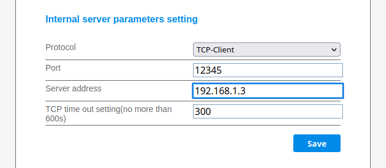

#### Proxy for SolarmanV5 data-loggers in TCP-Client mode

---

* Multi logger, multi client
  *  one logger can communicate with multiple clients, no client connections limit
     (limit is 5 when the logger is in TCP-Server mode)
  *  all clients communicate with the respective datalogger (serial number based)  

* Packets routing based on serial number
* Single point of communication with all data-loggers - one ip, one port (8899)
* Only V5 encoded packets are processed
* Recommended client [pysolarmanV5](https://github.com/jmccrohan/pysolarmanv5.git)

---
##### Usage
* Proxy start
    ```console
    go-solarmanV5-proxy <address> <port for data-logger connections>
    ```
    e.g.
    ```console
    go-solarmanV5-proxy 192.168.1.3 12345
    ```
  * `-debug` flag can be used to see what's going on under the hood :sunglasses:
  * all messages are logged to stdout for now 
* Data logger configuration (config_hide.html)


All clients then can be connected to port 8899 of the proxy server 

---
#### Build

```console
make 
```
* The binary will be placed in the `build` dir 
